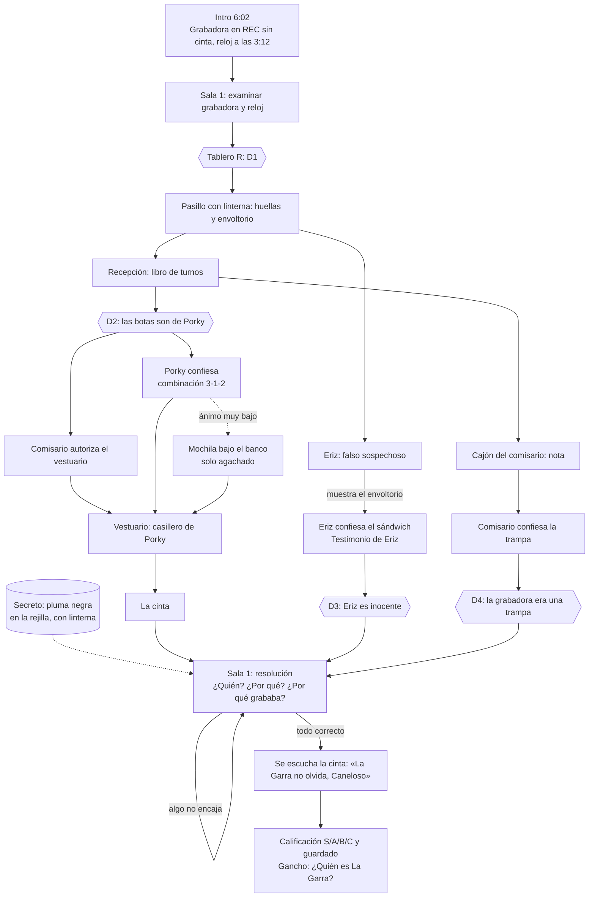

# HU-20 · Caso 0 «La cinta de las 3:12»: historia, diálogos y jugabilidad

Commit local `d05ab62` en la rama **HU-20** (sin subir a GitHub).

---

## 1. Resumen de la nueva historia

**Gancho (primeros 30 s).** Son las 6:02 de la mañana. La confesión grabada de **Tito Garras**, carterista detenido en la celda C-2, ha desaparecido, y el juicio es a las 12:00. En la Sala 1 la grabadora sigue en **REC, sin cinta**, y el reloj de la pared **se paró a las 3:12**. Pregunta inicial: *¿Qué pasó en esta sala a las 3:12?*

| Personaje | Papel | Motivación | Secreto | Por qué miente |
|---|---|---|---|---|
| **Eriz** (conserje, ex carterista «Dedos») | Falso sospechoso | Conservar su trabajo y proteger a un viejo amigo | Volvió a las 3:00 para llevarle un sándwich a Tito a la C-2; fueron compañeros de celda | Si el comisario se entera, lo despide |
| **Porky** (agente de guardia de 2:00 a 4:00) | Culpable | Que no lo echen por dormirse | Se durmió en la silla de la Sala 1, despertó con la luz de REC encendida, creyó que lo habían grabado roncando y escondió la cinta en su casillero | Vergüenza y miedo a una sanción |
| **Comisario** | Origen del giro | Pillar al agente que duerme en las guardias | Dejó la grabadora en REC a propósito como trampa (nota en su cajón: «Grabadora Sala 1: NO TOCAR») | Su trampa puso en peligro el juicio |

**Falso sospechoso.** Todo apunta a Eriz: tiene llave de todo, un pasado de carterista y Porky lo señala. El envoltorio de sándwich junto a la C-2 demuestra que estaba con Tito, no en la Sala 1, y sus zapatillas de goma no dejan huellas de bota.

**Giro deducible.** El robo no lo planeó nadie. Lo provocó la propia trampa del comisario: la grabadora en REC asustó a Porky al despertar. Se puede deducir uniendo la nota del comisario con la grabadora (D4) o el testimonio del comisario.

**Final.** El jugador explica en la Sala 1 quién fue, por qué lo hizo y por qué la grabadora estaba grabando. Si las tres respuestas son correctas, se escucha la cinta: a las 3:12, mientras Porky dormía, una voz desconocida susurra al micrófono **«La Garra no olvida, Caneloso.»** El reloj no se cayó solo.

**Gancho hacia los casos principales.** ¿Quién es «La Garra», el jefe del que hablaba Tito? La **pluma negra** secreta en la rejilla de ventilación del techo indica que alguien entró por ahí. Objetivo final: *«Caso cerrado... por ahora. ¿Quién es «La Garra»?»*

**Duración estimada.** De 15 a 20 minutos explorando las cuatro zonas, hablando con los tres NPC y armando las cuatro deducciones.

---

## 2. Árbol de diálogo de cada NPC

Tipos de opción: **PREGUNTAR** (neutral), **PRESIONAR** (baja el ánimo si no hay pruebas) y **EVIDENCIA** (abre el expediente para mostrar una prueba). Las opciones ya leídas aparecen marcadas, pero se pueden repetir. Las respuestas importantes se apuntan solas en la libreta **[Q]**. Una prueba que no viene al caso baja el ánimo en 1 («¿Y eso qué tiene que ver conmigo?»).

El ánimo va de −2 a +2 y cambia el saludo, la etiqueta de la caja de diálogo y la respiración del NPC (más rápida cuando está nervioso).

### Eriz (pasillo, junto a la C-2)

```
Saludo según ánimo
├─ [PREGUNTAR] ¿Qué hiciste anoche?
│     → «Me fui a la una, está firmado.»               📓 nota
├─ [PREGUNTAR] ¿Conoces a Tito Garras?
│     → «De vista...» + pensamiento: se le erizan las púas   📓 nota
├─ [PREGUNTAR] ¿Oíste algo a las 3:12?           (requiere: Reloj)
│     ├─ sin confesar → «Estaba en casa.» (mentira)
│     └─ tras confesar → oyó un golpe en la Sala 1 y la puerta del vestuario   📓 nota
├─ [PRESIONAR] «Tienes llave de todo... y un pasado de carterista»   (desaparece al confesar)
│     → ánimo −1, se cierra
└─ [EVIDENCIA]
      ├─ Envoltorio  → ★ CONFIESA: el sándwich para Tito a las 3:00
      │                 desbloquea la tarjeta «Testimonio de Eriz» (para D3), ánimo +3
      ├─ Huellas     → «Llevo zapatillas de goma.»   📓 nota
      ├─ Libro       → «Salida a la una» / «...y volví»
      └─ Reloj       → «A las doce funcionaba.»
```

### Porky (recepción)

```
Saludo según ánimo
├─ [PREGUNTAR] ¿Dónde estuviste durante la guardia?
│     → «Aquí, despierto como un búho.» (mentira)      📓 nota
├─ [PREGUNTAR] ¿Viste algo raro?
│     → señala a Eriz: «tiene llave de todo»            📓 nota
├─ [PREGUNTAR] ¿Qué hacías a las 3:12?           (requiere: Reloj)
│     ├─ sin confesar → «Vigilar... intensamente.», ánimo −1, miga de donut
│     └─ tras confesar → despertó a las 3:15 con el reloj en el suelo   📓 nota
├─ [PRESIONAR] «Tienes cara de haber dormido»     (antes de D2) → ánimo −1, amenaza con el sindicato
├─ [PRESIONAR] «Eras el único agente de guardia... y tus botas fueron al vestuario»   (requiere: D2)
│     → ★ CONFIESA y desbloquea la tarjeta «Testimonio de Porky»
│        ├─ ánimo ≥ −1 → da la combinación 3-1-2
│        └─ ánimo < −1 → se niega; hay que encontrar su mochila bajo el banco (agachado)
└─ [EVIDENCIA]
      ├─ Huellas → admite que era el único agente (ánimo −1 la primera vez)   📓 nota
      ├─ Libro   → «Guardia de dos a cuatro.»
      ├─ Envoltorio → «Soy más de donuts.»
      ├─ Reloj   → evasivo / «estaba en el suelo»
      └─ Nota del comisario → «¡Era una trampa!»
```

### Comisario (recepción, despacho)

```
Saludo según ánimo
├─ [PREGUNTAR] ¿Qué sabe de la grabadora?
│     → «No la toco desde las seis.» (mentira)          📓 nota
├─ [PREGUNTAR] ¿Quién vigilaba anoche?
│     → «Porky, de dos a cuatro.»                        📓 nota
├─ [PREGUNTAR] ¿Quién es Tito Garras?
│     → la cartera del alcalde y «La Garra»              📓 nota
├─ [PREGUNTAR] Necesito entrar en el vestuario.   (hasta autorizar)
│     ├─ sin D2 → «Tráeme algo sólido.» + pista para usar el tablero
│     └─ con D2 → ★ abre el Vestuario
├─ [PRESIONAR] «¿Seguro que no tocó la grabadora?»   (desaparece al confesar)
│     → ánimo −1 + pensamiento: «Ha mirado el cajón de su escritorio...»
└─ [EVIDENCIA]
      ├─ Nota del comisario → ★ CONFIESA LA TRAMPA (giro) y desbloquea la tarjeta «Testimonio del comisario»
      ├─ Libro   → «La nota del margen es mía.» + pensamiento
      ├─ Huellas → «¿Y quién estaba de guardia?»
      └─ Cinta   → «Explícamelo en la Sala 1.»
```

---

## 3. Tabla de pistas

| # | Nombre | Ubicación | Qué revela | Con qué NPC se usa |
|---|---|---|---|---|
| 1 | Grabadora en REC | Sala 1, sobre la mesa | Alguien la dejó grabando; el contador marca 03:12 | Comisario (con la nota, para D4) |
| 2 | Reloj parado a las 3:12 | Sala 1, pared | Algo pasó a las 3:12; desbloquea las preguntas sobre las 3:12 | Eriz, Porky |
| 3 | Huellas de bota | Pasillo, hacia el vestuario (con linterna) | Las dejó un agente, no el conserje | Porky, Eriz, Comisario |
| 4 | Envoltorio de sándwich | Pasillo, junto a la C-2 (con linterna) | Alguien le llevó comida a Tito de madrugada | **Eriz** (confesión) |
| 5 | Libro de turnos | Recepción, mostrador | Porky de guardia de 2:00 a 4:00; nota del margen «NO TOCAR» | Porky, Comisario, Eriz |
| 6 | Nota del comisario | Recepción, cajón del escritorio | La grabadora se dejó en REC a propósito | **Comisario** (giro), Porky |
| 7 | La cinta | Vestuario, casillero de Porky (combinación 3-1-2) | Rebobinada hasta las 03:12; contiene la voz desconocida | Comisario |
| 8 | Pluma negra *(secreta)* | Sala 1, rejilla del techo (con linterna) | Alguien entró por la ventilación: gancho hacia «La Garra» | Ninguno (cambia los pensamientos del final) |

**Deducciones del tablero [R]**

| Deducción | Cartas | Conclusión | Desbloquea |
|---|---|---|---|
| D1 | Grabadora + Reloj | A las 3:12 pasó algo en la Sala 1 | Objetivo: seguir el rastro |
| D2 | Huellas + Libro de turnos | Las botas son de Porky | Presión a Porky y permiso del vestuario |
| D3 | Envoltorio + Testimonio de Eriz | Eriz no fue | Descarta al falso sospechoso |
| D4 | Nota del comisario (o su testimonio) + Grabadora | La grabadora era una trampa | La tercera respuesta de la resolución |

---

## 4. Diagrama del flujo del caso



---

## 5. Cambios de jugabilidad realizados

**Diálogo**
- Caja de diálogo nueva con el estilo del HUD (papel, máquina de escribir y amarillo), retrato tipo polaroid, nombre y etiqueta de ánimo en cada línea. Un clic completa el texto, y las teclas 1 a 9 eligen una opción.
- Opciones Preguntar / Presionar / Evidencia, opciones que solo aparecen con ciertas pistas o deducciones, y opciones leídas marcadas pero repetibles.
- El ánimo de cada NPC reacciona a lo que dices y cambia su saludo, su respiración y si coopera (Porky solo da la combinación si no lo presionaste de más).
- Las respuestas importantes se guardan solas en la libreta **[Q]**, que ahora muestra las notas en dos columnas.

**Mecánicas inspiradas en otros juegos**
- **Ace Attorney:** presentar pruebas del expediente durante la conversación.
- **L.A. Noire:** pensamientos que leen las reacciones del NPC (púas erizadas, la miga de donut, la mirada al cajón).
- **Obra Dinn / Her Story:** la resolución de tres preguntas solo se confirma si todo es correcto («Algo no encaja todavía»).
- **Disco Elysium:** pensamientos internos la primera vez que miras ciertos objetos.
- **Tablero de deducción [R]:** une dos cartas (pistas o testimonios); si encajan, sale una conclusión que desbloquea objetivos.

**Bucle de juego**
- Aviso «+1 CONCLUSIÓN» y sonido al deducir.
- Pista secreta opcional (la pluma).
- Calificación final S/A/B/C según pistas, deducciones, confrontaciones y si acertaste a la primera.
- Ayudas progresivas: tras 100 s y 200 s sin avanzar aparece una pista según el punto del caso.

**Controles y objetivos**
- Deslizador de **sensibilidad del ratón** en Opciones (0.3 a 2.0, se guarda).
- **Shift** para correr (×1.6).
- El alcance de interacción se queda en 3 m.
- Cada objetivo dice exactamente el siguiente paso.

---

## 6. Confirmación de que no se rompió nada

Comprobado ejecutando el juego en Godot 4.7.2 con scripts de prueba automáticos:

| Prueba | Resultado |
|---|---|
| Partida completa de la historia (intro, 3 NPC, 4 deducciones, 8 pistas, resolución errónea y correcta) | **0 errores** |
| Regresión: 31 carteles caben en su marco | OK |
| Regresión: 21 contenedores abren, cierran y vuelven a abrir | OK |
| Mochila bajo el banco: solo se abre agachado | OK |
| Andamio: bloquea de pie, deja pasar agachado y mantiene agachado debajo | OK |
| Puertas: Sala → Pasillo, Pasillo → Vestuario, Pasillo → Recepción | OK, las tres |
| HUD: pistas con imagen, libreta, linterna y expediente [TAB] | OK (se oculta durante los diálogos y el tablero) |
| Menú de opciones: interruptor de agacharse y deslizador de sensibilidad | OK |
| Compilación C# (`dotnet build`) | Sin errores |

**Pendiente (no depende de este cambio):** cuando tu compañero suba el HUD nuevo, faltará añadir «[C] Agacharse» a su panel, corregir «Obserta.» → «Observa.» y conectar el contador de pistas.
